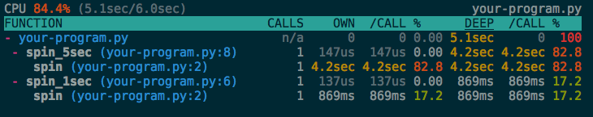

Profiling
=========

The profiling package is an interactive Python profiler.  It provides these
features:

1. An interactive TUI profiling statistics viewer.
1. Utilities for remote profiling.
1. Thread or greenlet aware CPU timer.
1. Supports both of Python 2 and Python 3.

[](https://travis-ci.org/what-studio/profiling)

Installation
------------

This project is under development yet.  So you should install it via GitHub
instead of PyPI:

```sh
$ pip install git+ssh://git@github.com/what-studio/profiling.git
```

Profiling
---------

To profile a single program, simply run `profile` command:

```sh
$ python -m profiling profile your-program.py
```

Then an interactive viewer will be executed:



If your program uses greenlets, choose `greenlet` timer:

```sh
$ python -m profiling profile your-program.py --timer=greenlet
```

With `--dump` option, it saves the profiling result to a file.  You can
browse save result by `view` command:

```sh
$ python -m profiling profile your-program.py --dump=your-program.prf
$ python -m profiling view your-program.prf
```

Live-profiling
--------------

If your program has a long life time like a web server, profiling result
at the end of progam doesn't help you.  You will need a continuos profiler.
It works by `live-profile` command:

```sh
$ python -m profiling live-profile webserver.py
```

See a demo: [https://asciinema.org/a/12318]().

There's a live-profiling server also.  The server doesn't profile the
program at ordinary times.  But when a client connects to the server, it
runs profiler and reports to the all connected clients.  Start a server
with `remote-profile` command:

```sh
$ python -m profiling remote-profile webserver.py --bind 127.0.0.1:8912
```

Then run a client with `view` command:

```sh
$ python -m profiling view 127.0.0.1:8912
```

Viewer key commands
-------------------

- <tt>q</tt> - Quit.
- <tt>space</tt> - Pause/Resume.
- <tt>↑</tt> and <tt>↓</tt> - Navigate frames.
- <tt>→</tt> - Expand the frame.
- <tt>←</tt> - Fold the frame.
- <tt>></tt> - Go to the hotspot.
- <tt>esc</tt> - Defocus.
- <tt>[</tt> and <tt>]</tt> - Change sorting colunm.

Licensing
---------

This project is opened under the [BSD 3-Clause] license.

[BSD 3-Clause]: http://opensource.org/licenses/BSD-3-Clause
