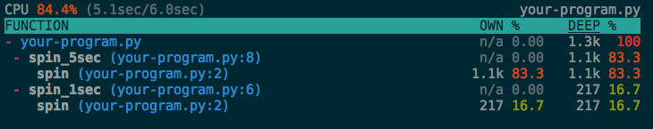

Profiling
=========

The profiling package is an interactive Python profiler.  It is inspired from
[Unity 3D] profiler.  This package provides these features:

- Profiling statistics keep the frame stack.
- An interactive TUI profiling statistics viewer.
- Provides both of statistical and deterministic profiling.
- Utilities for remote profiling.
- Thread or greenlet aware CPU timer.
- Supports Python 2.7, 3.3 and 3.4.
- Currently supports only Linux.

[![Build Status]
(https://travis-ci.org/what-studio/profiling.svg?branch=master)]
(https://travis-ci.org/what-studio/profiling)
[![Coverage Status]
(https://coveralls.io/repos/what-studio/profiling/badge.svg?branch=master)]
(https://coveralls.io/r/what-studio/profiling)

[Unity 3D]: http://unity3d.com/

Installation
------------

This project is still under development, so you should install it via GitHub
instead of PyPI:

```sh
pip install git+https://github.com/what-studio/profiling.git
```

Profiling
---------

To profile a single program, simply run `profile` command:

```sh
$ python -m profiling profile your-program.py
```

Then an interactive viewer will be executed:


If your program uses greenlets, choose `greenlet` timer:

```sh
$ python -m profiling profile --timer=greenlet your-program.py
```

With `--dump` option, it saves the profiling result to a file.  You can
browse the saved result by using the `view` command:

```sh
$ python -m profiling profile --dump=your-program.prf your-program.py
$ python -m profiling view your-program.prf
```

If your script reads ``sys.argv``, append your arguments after ``--``.
It isolates your arguments from the ``profile`` command:

```sh
$ python -m profiling profile your-program.py -- --your-flag --your-param=42
```

Live-profiling
--------------

If your program has a long life time like a web server, profiling result
at the end of program doesn't help you.  You will need a continuous profiler.
It works via `live-profile` command:

```sh
$ python -m profiling live-profile webserver.py
```

See a demo:

[](https://asciinema.org/a/25394)

There's a live-profiling server also.  The server doesn't profile the
program at ordinary times.  But when a client connects to the server, it
runs profiler and reports to the all connected clients.  Start a server
with `remote-profile` command:

```sh
$ python -m profiling remote-profile webserver.py --bind 127.0.0.1:8912
```

Then run a client with `view` command:

```sh
$ python -m profiling view 127.0.0.1:8912
```

Sampling Profiler
-----------------

`TracingProfiler`, the default profiler, implements a deterministic profiler
for deep call graph.  Of course, it has heavy overhead.  The overhead can
pollute your profiling result or can make your application to be slow.

In contrast, `SamplingProfiler` implements a statistical profiler.  Like other
statistical profilers, it also has only very cheap overhead.  When you profile
you can choose it by just `--sampling` (shortly `-S`) option:

```sh
$ python -m profiling live-profile -S webserver.py
                                   ^^
```



Timeit then Profiling
---------------------

Do you use `timeit` to check the performance of your code?

```sh
$ python -m timeit -s 'from trueskill import *' 'rate_1vs1(Rating(), Rating())'
1000 loops, best of 3: 722 usec per loop
```

If you want to profile the checked code, just add `profiling` before `timeit`:

```sh
$ python -m profiling timeit -s 'from trueskill import *' 'rate_1vs1(Rating(), Rating())'
            ^^^^^^^^^
```

Profiling from Code
-------------------

You can also profile your program by ``profiling.Profiler`` directly:

```python
from profiling import Profiler
from profiling.viewer import StatisticsViewer

# profile your program.
profiler = Profiler()
profiler.start()
...  # run your program.
profiler.stop()

# or using context manager.
with Profiler() as profiler:
    ...  # run your program.

# view the result.
stats, cpu_time, wall_time = profiler.result()
viewer = StatisticsViewer()
viewer.set_result(stats, cpu_time, wall_time)
loop = viewer.loop()
loop.run()
```

Viewer Key Commands
-------------------

- <tt>q</tt> - Quit.
- <tt>space</tt> - Pause/Resume.
- <tt>↑</tt> and <tt>↓</tt> - Navigate frames.
- <tt>→</tt> - Expand the frame.
- <tt>←</tt> - Fold the frame.
- <tt>></tt> - Go to the hotspot.
- <tt>esc</tt> - Defocus.
- <tt>[</tt> and <tt>]</tt> - Change sorting column.

Columns
-------

### Common

- `FUNCTION`
  1. The function name with the code location.
     (e.g. `my_func (my_code.py:42)`, `my_func (my_module:42)`)
  1. Only the location without line number.  (e.g. `my_code.py`, `my_module`)

### Tracing Profiler

- `CALLS` - Total call count of the function.
- `OWN` (Exclusive Time) - Total spent time in the function excluding sub
                           calls.
- `/CALL` after `OWN` - Exclusive time per call.
- `%` after `OWN` - Exclusive time per total spent time.
- `DEEP` (Inclusive Time) - Total spent time in the function.
- `/CALL` after `DEEP` - Inclusive time per call.
- `%` after `DEEP` - Inclusive time per total spent time.

### Sampling Profiler

- `OWN` (Exclusive Samples) - Number of samples which are collected during the
                              direct execution of the function.
- `%` after `OWN` - Exclusive samples per number of the total samples.
- `DEEP` (Inclusive Samples) - Number of samples which are collected during the
                               excution of the function.
- `%` after `DEEP` - Inclusive samples per number of the total samples.

Thanks to
---------

- [Seungmyeong Yang](https://github.com/sequoiayang) who suggested this project.
- [Pavel](https://github.com/htch) who inspired to implement ``-m`` option.

Licensing
---------

Written by [Heungsub Lee] at [What! Studio] in [Nexon], and
distributed under the [BSD 3-Clause] license.

[Heungsub Lee]: http://subl.ee/
[What! Studio]: https://github.com/what-studio
[Nexon]: http://nexon.com/
[BSD 3-Clause]: http://opensource.org/licenses/BSD-3-Clause
